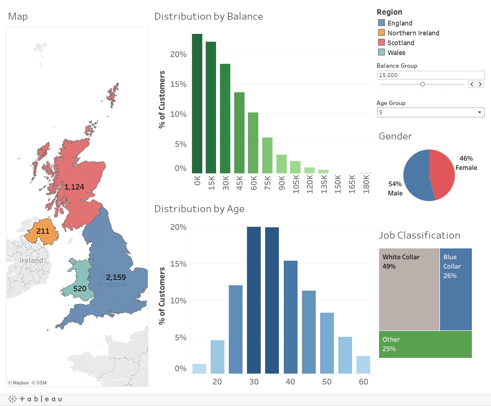

This dashboard analyzes dummy bank customer data from the United Kingdom.

- Added customizable balance and age bands with interactive filters.
- Segmented customer distributions by age, bank balance, location, and gender.
- Built an interactive dashboard for deriving business insights from customer segments.
