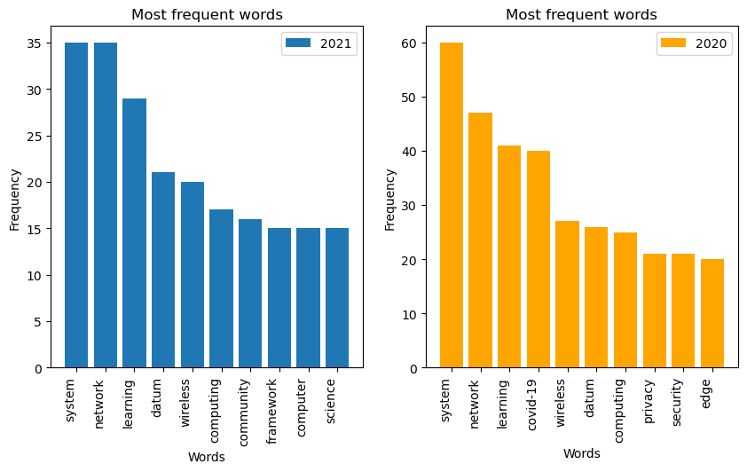

This project explores research grant data retrieved from the National Science Foundation.

- Transformed XML-formatted non-relational data into a tabular relational format.
- Preprocessed text by removing stopwords and missing values.
- Used text analysis tools such as PlaintextCorpusReader and BigramCollocationFinder to extract single-word, two-word, and three-word phrase frequencies.
- Applied K-means clustering, XGBoost, Random Forest, and NetworkX to draw insights from the text data.
