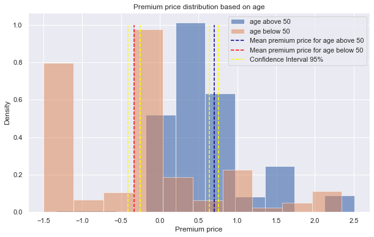

This project analyzes health insurance premium data using causal inference and machine learning methods.

- Conducted power analysis and hypothesis testing to identify relationships between features.
- Compared LASSO, Ridge, and Elastic Net regression for regularized prediction.
- Performed PCA, K-means clustering, and XGBoost classification to support diabetes-status analysis.
