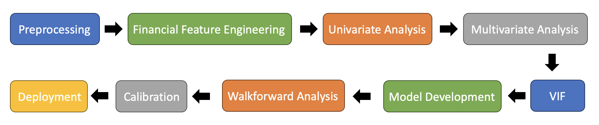

This project develops a logistic regression model to predict one-year probability of default for prospective borrowers.

- Trained a logistic regression model on historical bank transaction data to forecast default probabilities with an emphasis on explainability.
- Engineered financial features including liquidity, debt coverage, profitability, and leverage, and handled missing data with finance-based and median imputation.
- Performed feature selection with univariate and multivariate analysis and addressed multicollinearity with variance inflation factor analysis.
- Implemented walk-forward analysis and calibration, achieving an AUC of 0.7761 compared with a 0.701 baseline.
