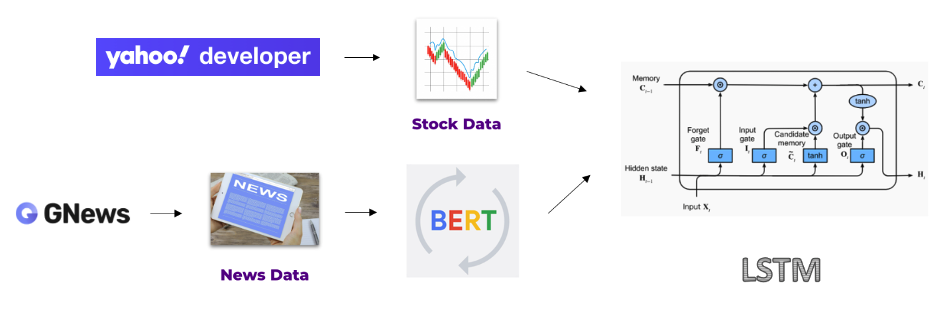

This project uses LSTM and BERT models to analyze the context of daily news headlines for stock movement forecasting.

- Aggregated and processed over 100,000 news articles, aligning them with historical stock data from the S&P 500.
- Developed a baseline LSTM model using stock data and an advanced hybrid model combining LSTM with BERT embeddings of news headlines.
- Implemented a custom tokenization strategy to handle BERT token limits and create daily news embeddings representing each day's context.
