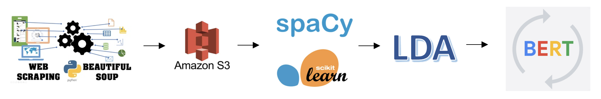

This NLP project performs topic modeling on news articles and refines topic groupings with clustering and transformer-based methods.

- Web scraped news articles and stored the collected data in Amazon S3.
- Built an LDA topic modeling baseline, then improved the topic workflow with K-means clustering and BERT.
- Evaluated performance with topic coherence and silhouette score.
- Visualized word importance per topic and summarized articles with BART.
