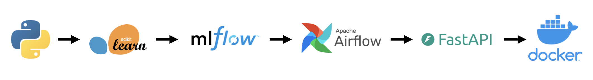

This project was about getting hands-on experience with the full MLOps workflow, perhaps less about the dataset itself. I used a common public prediction dataset because I wanted to focus on the system around the model: training, tracking, model selection, deployment, and exposing predictions through an API. 

- Designed and implemented an end-to-end prediction pipeline using Python, MLflow, FastAPI, and Docker.
- Built modular components for training, feature engineering, model evaluation, model comparison, and prediction.
- Used MLflow for experiment tracking, model artifacts, and model registry-style workflows.
- Deployed selected models through a FastAPI prediction service with request/response schemas and prediction tests.
- Containerized the MLflow tracking server, training workflow, and inference API with Docker Compose for reproducible local development and API testing.

The project is structured around three stages:

```text
01_initial_ml_build/  -> initial notebook exploration
02_model_training/   -> training pipeline, feature code, model comparison, Airflow DAG
03_deployment/       -> FastAPI app, Dockerfile, bundled model, prediction tests
```

The API can serve either a selected MLflow run or a bundled local model. If a `RUN_ID` is provided, the service loads the model from MLflow:

```text
runs:/<RUN_ID>/final_model
```

If no `RUN_ID` is set, it falls back to the local bundled model:

```text
03_deployment/saved_models/model.joblib
```

That made the project easier to test locally while keeping the MLflow-backed workflow as the main model selection and serving path.

If I were to extend this project, I would use a more meaningful dataset and spend more time on the modeling process itself. For this version, the main goal was to understand the workflow end to end: how a model moves from training code, to tracked experiments, to a selected artifact, to an API that can serve predictions.
