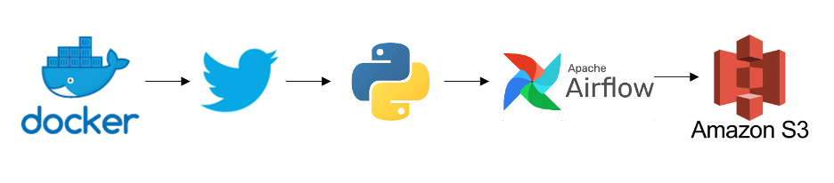

This data engineering project uses Airflow to orchestrate an ETL workflow for Twitter data, with tasks running inside Docker containers.

- Extracted Twitter data with API calls through Tweepy.
- Transformed JSON data into CSV using Python, pandas, and JSON tooling.
- Loaded processed data into AWS S3 with boto3.
- Used Airflow and Docker to create a controlled, isolated workflow for development, testing, and deployment.
